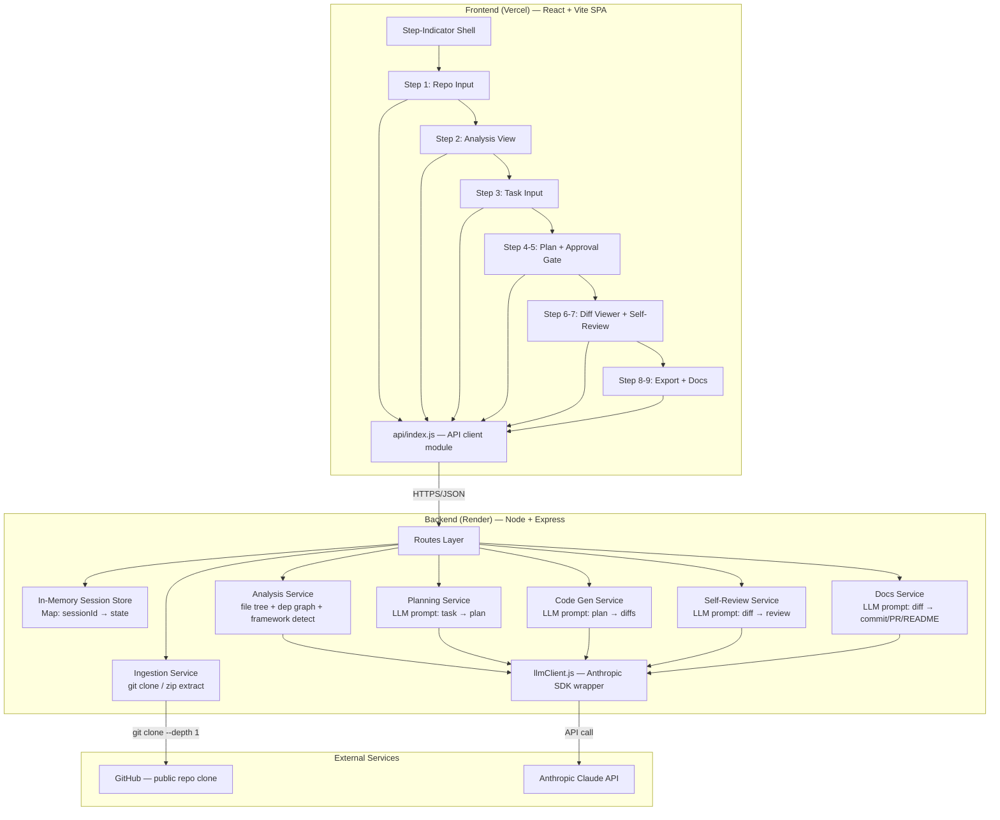
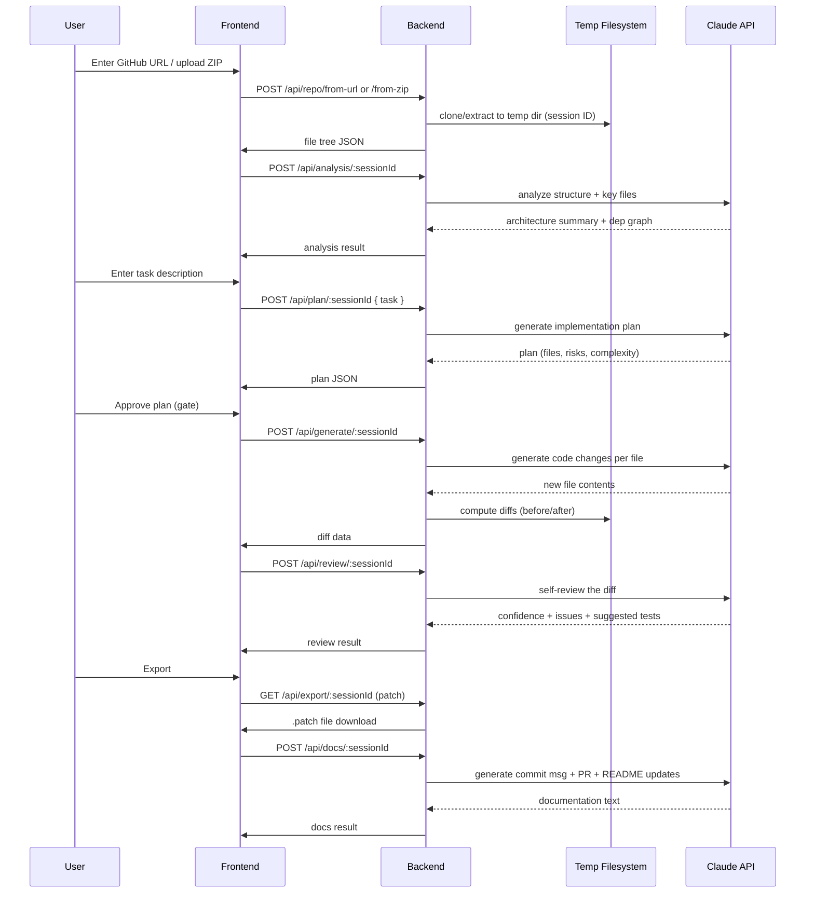
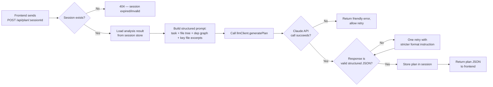

# ARCHITECTURE.md — CodePilot Agent

*Day 2 deliverable — technical architecture and finalized tech stack. Source of truth for Days 3–10 alongside the PRD and Implementation Blueprint.*

---

## 1. Finalized Tech Stack

| Layer | Choice | Why |
|---|---|---|
| **Frontend** | React 18 + Vite | Already scaffolded Day 1. Fast dev server, no SSR complexity to fight (this is a client-rendered SPA, not a content site). Matches the PRD's "single-page, step-indicator" flow. |
| **Backend** | Node.js + Express | Already scaffolded Day 1. Minimal, unopinionated — good fit for a handful of REST endpoints wrapping an LLM pipeline. Team already knows it. |
| **Database** | **None** — in-memory session store | PRD §6.9 and §9 explicitly rule out persistence across sessions. A DB (Mongo/Postgres) would add real setup and hosting cost for zero required functionality. Session state (session ID → cloned repo path + analysis results + plan + diff) lives in a server-side `Map` keyed by UUID, with best-effort TTL cleanup. If a future version needs history, this is the first thing to add — noted in PRD §10. |
| **Authentication** | **None** | PRD explicitly scopes out login/accounts (§7). Session ID (not a user identity) is enough to isolate concurrent demo users. |
| **AI Model/API** | Claude (Anthropic API) via `@anthropic-ai/sdk` | Already installed Day 1. Called **server-side only** — API key never touches the client, satisfying PRD's security NFR. Handles all 4 AI-driven steps: analysis summary, plan generation, code generation, self-review. |
| **Hosting — Frontend** | Vercel (free tier) | Zero-config static hosting for Vite builds, automatic HTTPS, generous free tier, deploys straight from GitHub. |
| **Hosting — Backend** | Render (free tier) | Supports long-running Node processes (needed for `git clone` and ZIP extraction, unlike serverless functions which have execution time/filesystem limits). Free tier is sufficient for demo traffic. |
| **Repo ingestion** | `simple-git` (npm) for GitHub URL clone; `multer` (upload) + `adm-zip` (extraction) for ZIP path | Avoids shelling out to raw `git` commands directly; `adm-zip` includes straightforward path handling for zip-slip protection. |
| **Diff/patch generation** | `diff` (npm) | Standard, well-tested library for generating unified diffs / `.patch` output — matches PRD §6.7 export requirement. |
| **Session IDs** | `uuid` (npm) | Simple, dependency-light UUID generation for session keys. |

**Explicitly not used:** MongoDB/Postgres, any auth library (Passport, Auth0, etc.), LangChain (direct SDK calls are more transparent and debuggable for a capstone demo), Docker/K8s (unnecessary for two simple free-tier deploys).

---

## 2. Component Diagram

---

## 3. Data Flow (End-to-End, 9 Steps)

---

## 4. Request Lifecycle (Single Request Example: Plan Generation)

---

## 5. AI Interaction Model

All AI calls happen through a single wrapper (`server/src/services/llmClient.js`) so prompt formatting, retries, and error handling are consistent across all 4 AI-driven steps:

| Step | Prompt Purpose | Output Format |
|---|---|---|
| Codebase Analysis | Summarize architecture, detect frameworks, describe key modules | Structured JSON (summary text + detected stack array + key files array) |
| Plan Generation | Turn task + codebase context into an implementation plan | Structured JSON (files array, each with description/risk/order) |
| Code Generation | Turn approved plan into actual file contents | JSON map of `{ filePath: newFileContent }` |
| Self-Review | Critique the generated diff | Structured JSON (confidence level, issues array, suggested tests array) |
| Documentation | Generate commit message, PR description, README suggestions | Structured JSON (commitMessage, prDescription, readmeSuggestions) |

**Design principle:** every LLM call requests strict JSON output (never free text) so the frontend can render structured UI rather than dumping raw model text — matching PRD §6.3's "not a raw text dump" requirement.

---

## 6. External Services

- **GitHub** — read-only, public repo cloning via shallow `git clone --depth 1`. No OAuth, no write access (matches PRD §7 out-of-scope).
- **Anthropic Claude API** — the only paid-adjacent external dependency; called exclusively server-side.

---

## 7. Session Lifecycle

1. First request from a new browser session → backend generates a UUID, returns it to frontend, frontend stores it (e.g. in memory/React state, not localStorage since no persistence is needed across reloads).
2. Session ID is sent with every subsequent request as a header or path param.
3. Server-side `Map<sessionId, SessionState>` holds: temp directory path, file tree, analysis result, plan, generated diffs, review result.
4. A simple interval-based cleanup job deletes session temp directories and map entries after N hours (e.g. 2 hours) or on server restart — sufficient for demo-length usage, per PRD's no-persistence scope.
