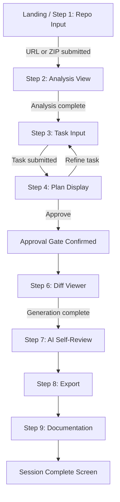

# UI-WIREFRAMES.md — CodePilot Agent

*Day 2 deliverable — complete user journey, screen flow, and low-fidelity wireframes. Every screen exists because it maps to one of the PRD's 9 user-journey steps.*

---

## 1. User Flow Diagram



There is no branching back after approval (matches PRD — plan approval is a hard gate); refinement only happens *before* approval, at the task-input stage.

---

## 2. Screen Flow (maps 1:1 to PRD's 9 steps)

| # | Screen | PRD Step | Purpose |
|---|---|---|---|
| 1 | Repo Input | 1 | Enter GitHub URL or upload ZIP |
| 2 | Analysis View | 2 | Show architecture summary, detected stack, file tree |
| 3 | Task Input | 3 | Free-text task description |
| 4 | Plan Review | 4–5 | Show generated plan; Approve/Refine gate |
| 5 | Diff Viewer | 6 | Side-by-side diffs with explanations |
| 6 | Self-Review Panel | 7 | Confidence, issues, suggested tests |
| 7 | Export | 8 | Download patch / copy code |
| 8 | Documentation | 9 | Commit message, PR description, README suggestions |
| 9 | Session Complete | — | Summary + links to all generated artifacts |

Every screen sits behind a persistent **step-indicator shell** (built Day 2) so the user always knows where they are in the 9-step journey — this satisfies the PRD's usability NFR directly.

---

## 3. Navigation Rules

- Linear, forward-only flow after the approval gate (no back-navigation once code generation starts — regenerating requires no persistence across sessions anyway, per PRD scope).
- Before approval: user *can* go back to Task Input to refine and regenerate the plan.
- A persistent step indicator (1–9) is always visible at the top; completed steps are checked off, current step is highlighted, future steps are dimmed/inactive.
- No global nav menu needed — this is a single guided session, not a multi-page app.

---

## 4. Low-Fidelity Wireframes

### Screen 1 — Repo Input
```
┌──────────────────────────────────────────────┐
│  [●1 ○2 ○3 ○4 ○5 ○6 ○7 ○8 ○9]  CodePilot Agent │
├──────────────────────────────────────────────┤
│                                                │
│   [ GitHub URL ]  [ Upload ZIP ]  ← toggle    │
│                                                │
│   ┌──────────────────────────────────────┐   │
│   │ https://github.com/owner/repo         │   │
│   └──────────────────────────────────────┘   │
│                                                │
│              [ Analyze Repository → ]         │
│                                                │
└──────────────────────────────────────────────┘
```

### Screen 2 — Analysis View
```
┌──────────────────────────────────────────────┐
│  [✓1 ●2 ○3 ○4 ○5 ○6 ○7 ○8 ○9]                  │
├──────────────────────────────────────────────┤
│  Architecture Summary                         │
│  ┌────────────────────────────────────────┐  │
│  │ This is a React + Express MERN app...   │  │
│  └────────────────────────────────────────┘  │
│  Detected Stack: [React] [Express] [Vite]     │
│                                                │
│  File Tree            │  Key Files            │
│  ▸ src/                │  • package.json      │
│    ▸ components/       │  • src/index.js      │
│    ▸ App.jsx           │  • server/index.js   │
│                                                │
│              [ Continue → ]                   │
└──────────────────────────────────────────────┘
```

### Screen 3 — Task Input
```
┌──────────────────────────────────────────────┐
│  [✓1 ✓2 ●3 ○4 ○5 ○6 ○7 ○8 ○9]                  │
├──────────────────────────────────────────────┤
│  Describe what you'd like to change           │
│  ┌────────────────────────────────────────┐  │
│  │ Add a dark mode toggle to the settings  │  │
│  │ page                                    │  │
│  └────────────────────────────────────────┘  │
│  e.g. "Add form validation", "Fix the..."     │
│                                                │
│              [ Generate Plan → ]              │
└──────────────────────────────────────────────┘
```

### Screen 4 — Plan Review (Approval Gate)
```
┌──────────────────────────────────────────────┐
│  [✓1 ✓2 ✓3 ●4 ○5 ○6 ○7 ○8 ○9]                  │
├──────────────────────────────────────────────┤
│  Implementation Plan     Risk: Low            │
│  ┌────────────────────────────────────────┐  │
│  │ 1. src/context/ThemeContext.jsx  [low]  │  │
│  │    Create new theme context provider    │  │
│  │ 2. src/App.jsx  [low]                   │  │
│  │    Wrap app in ThemeProvider            │  │
│  └────────────────────────────────────────┘  │
│  Complexity: Small                            │
│                                                │
│  [ ← Refine Task ]      [ ✓ Approve Plan ]    │
└──────────────────────────────────────────────┘
```

### Screen 5 — Diff Viewer
```
┌──────────────────────────────────────────────┐
│  [✓1 ✓2 ✓3 ✓4 ●5 ○6 ○7 ○8 ○9]                  │
├──────────────────────────────────────────────┤
│  src/context/ThemeContext.jsx     [new file]  │
│  ┌───────────────┬────────────────────────┐  │
│  │ Before (empty) │ After                  │  │
│  │                │ import { createContext}│  │
│  │                │ ...                    │  │
│  └───────────────┴────────────────────────┘  │
│  💬 Creates the theme context and provider    │
│                                                │
│              [ Continue → ]                   │
└──────────────────────────────────────────────┘
```

### Screen 6 — Self-Review Panel
```
┌──────────────────────────────────────────────┐
│  [✓1 ✓2 ✓3 ✓4 ✓5 ●6 ○7 ○8 ○9]                  │
├──────────────────────────────────────────────┤
│  Confidence: ● High                           │
│                                                │
│  Issues Found                                 │
│  ⚠ Edge case: No fallback if localStorage      │
│    is unavailable (ThemeContext.jsx)          │
│                                                │
│  Suggested Tests                              │
│  • Test that theme persists across reload     │
│                                                │
│              [ Continue → ]                   │
└──────────────────────────────────────────────┘
```

### Screen 7 — Export
```
┌──────────────────────────────────────────────┐
│  [✓1 ✓2 ✓3 ✓4 ✓5 ✓6 ●7 ○8 ○9]                  │
├──────────────────────────────────────────────┤
│         [ ⬇ Download .patch file ]            │
│                                                │
│  Or copy individual files:                    │
│  ┌────────────────────────────────────────┐  │
│  │ src/context/ThemeContext.jsx  [Copy]    │  │
│  │ src/App.jsx                   [Copy]    │  │
│  └────────────────────────────────────────┘  │
│                                                │
│              [ Continue → ]                   │
└──────────────────────────────────────────────┘
```

### Screen 8 — Documentation
```
┌──────────────────────────────────────────────┐
│  [✓1 ✓2 ✓3 ✓4 ✓5 ✓6 ✓7 ●8 ○9]                  │
├──────────────────────────────────────────────┤
│  Commit Message                    [Copy]     │
│  ┌────────────────────────────────────────┐  │
│  │ feat: add dark mode toggle to settings  │  │
│  └────────────────────────────────────────┘  │
│  PR Description                    [Copy]     │
│  ┌────────────────────────────────────────┐  │
│  │ ## Summary ...                          │  │
│  └────────────────────────────────────────┘  │
│  README Suggestions                [Copy]     │
│                                                │
│              [ Finish Session → ]             │
└──────────────────────────────────────────────┘
```

### Screen 9 — Session Complete
```
┌──────────────────────────────────────────────┐
│  [✓1 ✓2 ✓3 ✓4 ✓5 ✓6 ✓7 ✓8 ✓9]                  │
├──────────────────────────────────────────────┤
│           ✅ Session Complete                 │
│                                                │
│  You changed 2 files to: "Add a dark mode     │
│  toggle to the settings page"                 │
│                                                │
│  [ Download Patch ]  [ View Documentation ]   │
│                                                │
│              [ Start New Session ]            │
└──────────────────────────────────────────────┘
```

---

## 5. Responsive Notes

- Single-column layout on narrow widths (diff viewer stacks before/after vertically instead of side-by-side below ~768px).
- Step indicator collapses to a compact "Step 4 of 9" text + progress bar on mobile rather than 9 individual dots.
